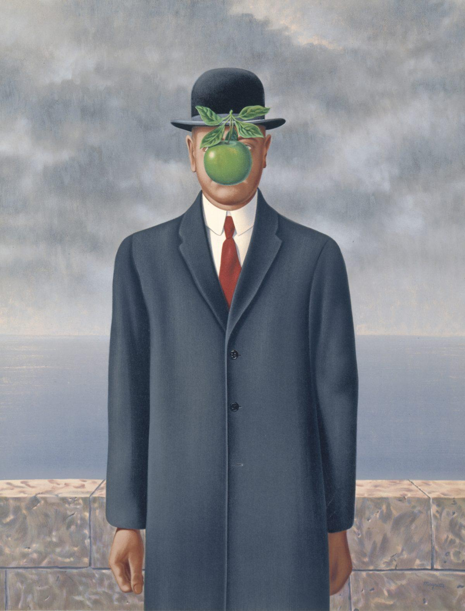
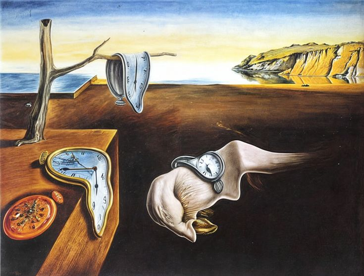
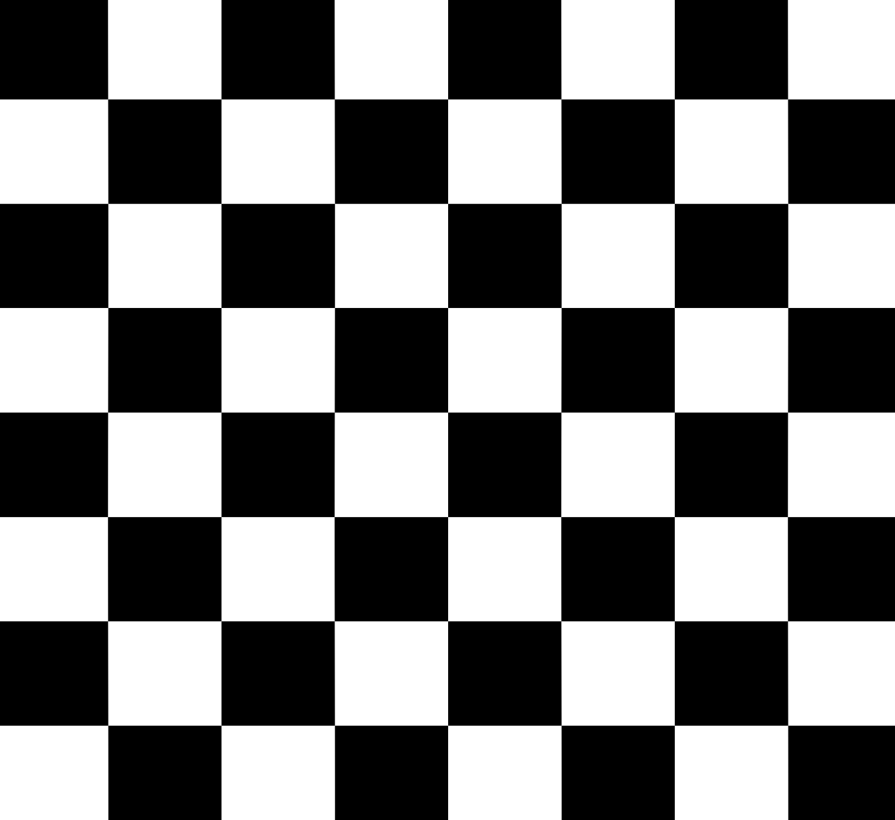
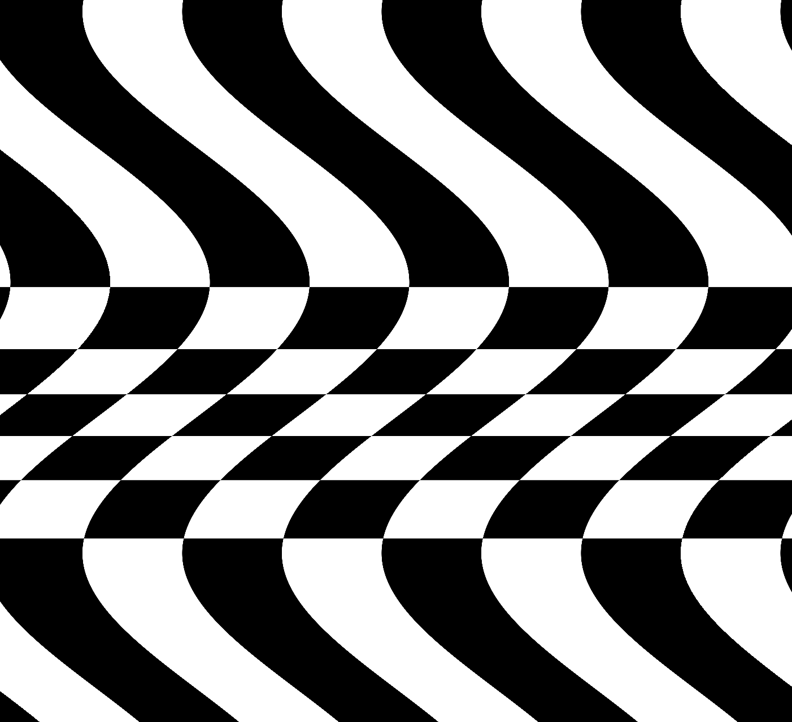

# Quiz 8 - Design Research

## Part 1: Imaging Technique Inspiration

### Chosen Technique: [    
* image() layering
* tint() （color）
* translate() / rotate() / scale()]

I am inspired by surrealist imaging techniques in The Son of Man and The Persistence of Memory.
These works use distortion, unexpected object placement, and visual obstruction to challenge reality and perception.

In my final project, I plan to incorporate surreal transformations through digital techniques such as layering and animation. I will also use a vintage-inspired color palette to enhance the nostalgic and symbolic atmosphere.

This approach is beneficial because it allows abstract ideas, such as identity and perception, to be expressed through dynamic and visually engaging imagery.

#### Visual Reference

###### René Magritte - SonofMan

###### Salvador Dalí - The Persistence of Memory

---

## Part 2: Coding Technique Exploration

### Implementation Strategy: [p5.js image distortion]

This sketch uses p5.js image processing and animation techniques, where images are manipulated in real time within the draw() loop. By continuously updating visuals frame by frame, it allows distortion, layering, and dynamic transformation effects to emerge.  

This is useful for my project because it enables surreal visual outcomes, such as shifting forms, visual disruption, and collage-like composition. These effects help translate abstract concepts like identity distortion and altered perception into dynamic, time-based visuals rather than static images.

#### Demonstration

**Example Implementation:**
*   [View Live Example]
code on p5 editor: https://editor.p5js.org/sadbot.tech/sketches/Qynekjy7u 
code on open processing: https://www.openprocessing.org/sketch/1048997